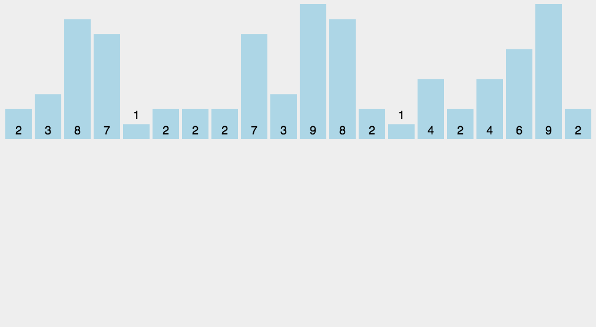

# 十大经典排序算法

## 导读

> 十大排序算法可以说是每个程序员都必须得掌握的。

### 0、算法概述

#### 0.1 算法分类

十种常见排序算法可以分为两大类：

- 比较类排序：通过比较来决定元素间的相对次序，由于其时间复杂度不能突破O(nlogn)，因此也称为非线性时间比较类排序。

- 非比较类排序：不通过比较来决定元素间的相对次序，它可以突破基于比较排序的时间下界，以线性时间运行，因此也称为线性时间非比较类排序。


#### 0.2 算法复杂度


#### 0.3 相关概念

- 稳定排序：如果 a 原本在 b 的前面，且 a == b，排序之后 a 仍然在 b 的前面，则为稳定排序。

- 非稳定排序：如果 a 原本在 b 的前面，且 a == b，排序之后 a 可能不在 b 的前面，则为非稳定排序。

- 原地排序：原地排序就是指在排序过程中不申请多余的存储空间，只利用原来存储待排数据的存储空间进行比较和交换的数据排序。

- 非原地排序：需要利用额外的数组来辅助排序。

- 时间复杂度：一个算法执行所消耗的时间。对排序数据的总的操作次数。反映当n变化时，操作次数呈现什么规律。

- 空间复杂度：运行完一个算法所需的内存大小。是指算法在计算机内执行时所需存储空间的度量，它也是数据规模n的函数。

### 1、冒泡排序（Bubble Sort）

冒泡排序是一种简单的排序算法。它重复地走访过要排序的数列，一次比较两个元素，如果它们的顺序错误就把它们交换过来。走访数列的工作是重复地进行直到没有再需要交换，也就是说该数列已经排序完成。这个算法的名字由来是因为越小的元素会经由交换慢慢“浮”到数列的顶端。

#### 1.1 算法描述

1. 比较相邻的元素。如果第一个比第二个大，就交换它们两个；

2. 对每一对相邻元素作同样的工作，从开始第一对到结尾的最后一对，这样在最后的元素应该会是最大的数；

3. 针对所有的元素重复以上的步骤，除了最后一个；

4. 重复步骤1~3，直到排序完成。

#### 1.2 动图演示


#### 1.3 算法分析

- 时间复杂度：O(n2)

- 空间复杂度：O(1)

- 稳定排序

- 原地排序

#### 1.4 代码实现

- Python

```python
def bubble_sort(data):
    """
    :param data: list
    :return: sorted data
    """

    length = len(data)
    if length < 2:
        return data

    for i in range(length - 1):
        for j in range(length - 1 - i):
            if data[j + 1] < data[j]:
                data[j], data[j + 1] = data[j + 1], data[j]
        # print(data)
    return data


if __name__ == "__main__":
    # 原始乱序
    d0 = [2, 15, 5, 9, 7, 6, 4, 12, 5, 4, 2, 64, 5, 6, 4, 2, 3, 54, 45, 4, 44]
    d1 = bubble_sort(d0)
    print(d1)
    # 正确排序
    # [2, 2, 2, 3, 4, 4, 4, 4, 5, 5, 5, 6, 6, 7, 9, 12, 15, 44, 45, 54, 64]

```

- Java

```java
public class BubbleSort {
    public static int[] bubbleSort(int[] arr) {
        if (arr == null || arr.length < 2) {
            return arr;
        }
        int n = arr.length;
        for (int i = 0; i < n; i++) {
            for (int j = 0; j < n -i - 1; j++) {
                if (arr[j + 1] < arr[j]) {
                    int t = arr[j];
                    arr[j] = arr[j+1];
                    arr[j+1] = t;
                }
            }
        }
        return arr;
    }
)
```

- JavaScript

```javascript
function bubbleSort(arr) {
    var len = arr.length;
    for (var i = 0; i < len - 1; i++) {
        for (var j = 0; j < len - 1 - i; j++) {
            if (arr[j] > arr[j+1]) {       // 相邻元素两两对比
                var temp = arr[j+1];       // 元素交换
                arr[j+1] = arr[j];
                arr[j] = temp;
            }
        }
    }
    return arr;
}
```

### 2、选择排序（Selection Sort）

选择排序(Selection-sort)是一种简单直观的排序算法。它的工作原理：首先在未排序序列中找到最小（大）元素，存放到排序序列的起始位置，然后，再从剩余未排序元素中继续寻找最小（大）元素，然后放到已排序序列的末尾。以此类推，直到所有元素均排序完毕。

#### 2.1 算法描述

n个记录的直接选择排序可经过n-1趟直接选择排序得到有序结果。

具体算法描述如下：

1. 初始状态：无序区为R[1..n]，有序区为空；

2. 第i趟排序(i=1,2,3…n-1)开始时，当前有序区和无序区分别为R[1..i-1]和R(i..n）。该趟排序从当前无序区中-选出关键字最小的记录 R[k]，将它与无序区的第1个记录R交换，使R[1..i]和R[i+1..n)分别变为记录个数增加1个的新有序区和记录个数减少1个的新无序区；

3. n-1趟结束，数组有序化了。

#### 2.2 动图演示


#### 2.3 算法分析

表现最稳定的排序算法之一，因为无论什么数据进去都是O(n2)的时间复杂度，所以用到它的时候，数据规模越小越好。唯一的好处可能就是不占用额外的内存空间了吧。理论上讲，选择排序可能也是平时排序一般人想到的最多的排序方法了吧。

- 时间复杂度：O(n2)

- 空间复杂度：O(1)

- 非稳定排序

- 原地排序
　　
#### 2.4 代码实现

- Python

```python
def select_sort(data):
    """
    :param data: list
    :return: sorted data
    """

    length = len(data)
    if length < 2:
        return data

    for i in range(length - 1):
        # 最小值的索引
        minIndex = i
        for j in range(i + 1, length):
            # 找到最小值的索引
            if data[j] < data[minIndex]:
                minIndex = j
            # 将最小的值放在i处
            data[i], data[minIndex] = data[minIndex], data[i]
        # print(data)
    return data


if __name__ == "__main__":
    # 原始乱序
    d0 = [2, 15, 5, 9, 7, 6, 4, 12, 5, 4, 2, 64, 5, 6, 4, 2, 3, 54, 45, 4, 44]
    d1 = select_sort(d0)
    print(d1)
    # 正确排序
    # [2, 2, 2, 3, 4, 4, 4, 4, 5, 5, 5, 6, 6, 7, 9, 12, 15, 44, 45, 54, 64]

```

- Java

```java
public class SelectSort {
    public static int[] selectSort(int[] a) {
        int n = a.length;
       for (int i = 0; i < n - 1; i++) {
            int min = i;
            for (int j = i + 1; j < n; j++) {
               if(a[min] > a[j]) min = j;
            }
            //交换
            int temp = a[i];
            a[i] = a[min];
            a[min] = temp;
        }
        return a;
    }
}
```

- JavaScript

```JavaScript
function selectionSort(arr) {
    var len = arr.length;
    var minIndex, temp;
    for (var i = 0; i < len - 1; i++) {
        minIndex = i;
        for (var j = i + 1; j < len; j++) {
            if (arr[j] < arr[minIndex]) {    // 寻找最小的数
                minIndex = j;                // 将最小数的索引保存
            }
        }
        temp = arr[i];
        arr[i] = arr[minIndex];
        arr[minIndex] = temp;
    }
    return arr;
}
```

### 3、插入排序（Insertion Sort）

插入排序（Insertion-Sort）的算法描述是一种简单直观的排序算法。它的工作原理是通过构建有序序列，对于未排序数据，在已排序序列中从后向前扫描，找到相应位置并插入。

#### 3.1 算法描述

一般来说，插入排序都采用in-place在数组上实现。

具体算法描述如下：

1. 从第一个元素开始，该元素可以认为已经被排序；

2. 取出下一个元素，在已经排序的元素序列中从后向前扫描；

3. 如果该元素（已排序）大于新元素，将该元素移到下一位置；

4. 重复步骤3，直到找到已排序的元素小于或者等于新元素的位置；

5. 将新元素插入到该位置后；

6. 重复步骤2~5。

#### 3.2 动图演示


#### 3.3 算法分析

插入排序在实现上，通常采用in-place排序（即只需用到O(1)的额外空间的排序），因而在从后向前扫描过程中，需要反复把已排序元素逐步向后挪位，为最新元素提供插入空间。

- 时间复杂度：O(n2)

- 空间复杂度：O(1)

- 稳定排序

- 原地排序

#### 3.4 代码实现

- Python

```python
def insert_sort(data):
    """
    :param data:list
    :return: sorted data
    """
    length = len(data)
    if length < 2:
        return data

    for i in range(0, length - 1):
        preIndex = i
        current = data[i + 1]
        while preIndex >= 0 and current < data[preIndex]:
            # 增加空间
            data[preIndex + 1] = data[preIndex]
            preIndex -= 1
        data[preIndex + 1] = current
        # print(data)
    return data


if __name__ == "__main__":
    # 原始乱序
    d0 = [2, 15, 5, 9, 7, 6, 4, 12, 5, 4, 2, 64, 5, 6, 4, 2, 3, 54, 45, 4, 44]
    d1 = insert_sort(d0)
    print(d1)
    # 正确排序
    # [2, 2, 2, 3, 4, 4, 4, 4, 5, 5, 5, 6, 6, 7, 9, 12, 15, 44, 45, 54, 64]

```

- Java

```java
public class InsertSort {
    public static int[] insertSort(int[] arr) {
        if(arr == null || arr.length < 2)
            return arr;

        int n = arr.length;
        for (int i = 1; i < n; i++) {
            int temp = arr[i];
            int k = i - 1;
            while(k >= 0 && arr[k] > temp)
                k--;
            //腾出位置插进去,要插的位置是 k + 1;
            for(int j = i ; j > k + 1; j--)
                arr[j] = arr[j-1];
            //插进去
            arr[k+1] = temp;
        }
        return arr;
    }
}
```

- JavaScript

```JavaScript
function insertionSort(arr) {
    var len = arr.length;
    var preIndex, current;
    for (var i = 1; i < len; i++) {
        preIndex = i - 1;
        current = arr[i];
        while (preIndex >= 0 && arr[preIndex] > current) {
            arr[preIndex + 1] = arr[preIndex];
            preIndex--;
        }
        arr[preIndex + 1] = current;
    }
    return arr;
}
```

### 4、希尔排序（Shell Sort）

1959年Shell发明，第一个突破O(n2)的排序算法，是简单插入排序的改进版。它与插入排序的不同之处在于，它会优先比较距离较远的元素。希尔排序又叫缩小增量排序。

#### 4.1 算法描述

先将整个待排序的记录序列分割成为若干子序列分别进行直接插入排序。

具体算法描述：

1. 选择一个增量序列t1，t2，…，tk，其中ti>tj，tk=1；

2. 按增量序列个数k，对序列进行k 趟排序；

3. 每趟排序，根据对应的增量ti，将待排序列分割成若干长度为m 的子序列，分别对各子表进行直接插入排序。仅增量因子为1 时，整个序列作为一个表来处理，表长度即为整个序列的长度。

#### 4.2 动图演示


#### 4.3 算法分析

希尔排序的核心在于间隔序列的设定。既可以提前设定好间隔序列，也可以动态的定义间隔序列。动态定义间隔序列的算法是《算法（第4版）》的合著者Robert Sedgewick提出的。

- 时间复杂度：O(nlogn)

- 空间复杂度：O(1)

- 非稳定排序

- 原地排序

#### 4.4 代码实现

- Python

```python
def shell_sort(data):
    """
    :param data: list
    :return: sorted data
    """
    length = len(data)
    if length < 2:
        return data

    step = length // 2
    while step > 0:
        for i in range(step, length):
            while i >= step and data[i - step] > data[i]:
                data[i - step], data[i] = data[i], data[i - step]
                i -= step
        # print(data)
        step = step // 2
    return data


if __name__ == "__main__":
    # 原始乱序
    d0 = [2, 15, 5, 9, 7, 6, 4, 12, 5, 4, 2, 64, 5, 6, 4, 2, 3, 54, 45, 4, 44]
    d1 = shell_sort(d0)
    print(d1)
    # 正确排序
    # [2, 2, 2, 3, 4, 4, 4, 4, 5, 5, 5, 6, 6, 7, 9, 12, 15, 44, 45, 54, 64]

```

- Java

```java
public class ShellSort {
    public static int[] shellSort(int arr[]) {
        if (arr == null || arr.length < 2) return arr;
        int n = arr.length;
        // 对每组间隔为 h的分组进行排序，刚开始 h = n / 2;
         for (int h = n / 2; h > 0; h /= 2) {
            //对各个局部分组进行插入排序
             for (int i = h; i < n; i++) {
                // 将arr[i] 插入到所在分组的正确位置上
                insertI(arr, h, i);
            }
     }
     return arr;
    }

    /**
     * 将arr[i]插入到所在分组的正确位置上
     * arr[i]] 所在的分组为 ... arr[i-2*h],arr[i-h], arr[i+h] ...
     */
    private static void insertI(int[] arr, int h, int i) {
        int temp = arr[i];
        int k;
        for (k = i - h; k > 0 && temp < arr[k]; k -= h) {
            arr[k + h] = arr[k];
        }
        arr[k + h] = temp;
    }
}
```

- JavaScript

```JavaScript
function shellSort(arr) {
    var len = arr.length;
    for (var gap = Math.floor(len / 2); gap > 0; gap = Math.floor(gap / 2)) {
        // 注意：这里和动图演示的不一样，动图是分组执行，实际操作是多个分组交替执行
        for (var i = gap; i < len; i++) {
            var j = i;
            var current = arr[i];
            while (j - gap >= 0 && current < arr[j - gap]) {
                 arr[j] = arr[j - gap];
                 j = j - gap;
            }
            arr[j] = current;
        }
    }
    return arr;
}
```

### 5、归并排序（Merge Sort）

归并排序是建立在归并操作上的一种有效的排序算法。该算法是采用分治法（Divide and Conquer）的一个非常典型的应用。将已有序的子序列合并，得到完全有序的序列；即先使每个子序列有序，再使子序列段间有序。若将两个有序表合并成一个有序表，称为2-路归并。

#### 5.1 算法描述

1. 把长度为n的输入序列分成两个长度为n/2的子序列；

2. 对这两个子序列分别采用归并排序；

3. 将两个排序好的子序列合并成一个最终的排序序列。

#### 5.2 动图演示


#### 5.3 算法分析

归并排序是一种稳定的排序方法。和选择排序一样，归并排序的性能不受输入数据的影响，但表现比选择排序好的多，因为始终都是O(nlogn）的时间复杂度。代价是需要额外的内存空间。

- 时间复杂度：O(nlogn)

- 空间复杂度：O(n)

- 稳定排序

- 非原地排序

#### 5.4 代码实现

- Python

```python
def merge_sort(data):
    """
    :param data: list
    :return: sorted data
    """
    length = len(data)
    if length < 2:
        return data
    mid = length // 2
    # 分别对两个子列表并归排序
    merge_left = merge_sort(data[:mid])
    merge_right = merge_sort(data[mid:])

    def merge(data_left, data_right):
        # print(data_left, data_right)
        """
        合并(将两个有序的列表合并成一个有序的列表)
        :param data_left: data[:mid]
        :param data_right:data[mid:]
        :return: sorted data
        """
        left, right = 0, 0
        len_left = len(data_left)
        len_right = len(data_right)
        sorted_data = []
        while left < len_left and right < len_right:
            if data_left[left] < data_right[right]:
                sorted_data.append(data_left[left])
                left += 1
            else:
                sorted_data.append(data_right[right])
                right += 1
        sorted_data += data_left[left:]
        sorted_data += data_right[right:]
        return sorted_data

    # 合并(将两个有序的列表合并成一个有序的列表)
    return merge(merge_left, merge_right)


if __name__ == "__main__":
    # 原始乱序
    d0 = [2, 15, 5, 9, 7, 6, 4, 12, 5, 4, 2, 64, 5, 6, 4, 2, 3, 54, 45, 4, 44]
    d1 = merge_sort(d0)
    print(d1)
    # 正确排序
    # [2, 2, 2, 3, 4, 4, 4, 4, 5, 5, 5, 6, 6, 7, 9, 12, 15, 44, 45, 54, 64]

```

- Java

```java
public class MergeSort {
    // 归并排序
    public static int[] mergeSort(int[] arr, int left, int right) {
        // 如果 left == right，表示数组只有一个元素，则不用递归排序
        if (left < right) {
            // 把大的数组分隔成两个数组
            int mid = (left + right) / 2;
            // 对左半部分进行排序
            arr = mergeSort(arr, left, mid);
            // 对右半部分进行排序
            arr = mergeSort(arr, mid + 1, right);
            //进行合并
            merge(arr, left, mid, right);
        }
        return arr;
    }

    // 合并函数，把两个有序的数组合并起来
    // arr[left..mif]表示一个数组，arr[mid+1 .. right]表示一个数组
    private static void merge(int[] arr, int left, int mid, int right) {
        //先用一个临时数组把他们合并汇总起来
        int[] a = new int[right - left + 1];
        int i = left;
        int j = mid + 1;
        int k = 0;
        while (i <= mid && j <= right) {
            if (arr[i] < arr[j]) {
                a[k++] = arr[i++];
            } else {
                a[k++] = arr[j++];
            }
        }
        while(i <= mid) a[k++] = arr[i++];
        while(j <= right) a[k++] = arr[j++];
        // 把临时数组复制到原数组
        for (i = 0; i < k; i++) {
            arr[left++] = a[i];
        }
    }
}
```

- JavaScript

```JavaScript
function mergeSort(arr) {
    var len = arr.length;
    if (len < 2) {
        return arr;
    }
    var middle = Math.floor(len / 2),
        left = arr.slice(0, middle),
        right = arr.slice(middle);
    return merge(mergeSort(left), mergeSort(right));
}

function merge(left, right) {
    var result = [];

    while (left.length>0 && right.length>0) {
        if (left[0] <= right[0]) {
            result.push(left.shift());
        }else {
            result.push(right.shift());
        }
    }

    while (left.length)
        result.push(left.shift());

    while (right.length)
        result.push(right.shift());

    return result;
}
```

### 6、快速排序（Quick Sort）

快速排序的基本思想：通过一趟排序将待排记录分隔成独立的两部分，其中一部分记录的关键字均比另一部分的关键字小，则可分别对这两部分记录继续进行排序，以达到整个序列有序。

#### 6.1 算法描述

快速排序使用分治法来把一个串（list）分为两个子串（sub-lists）。

具体算法描述如下：

1. 从数列中挑出一个元素，称为 “基准”（pivot）；

2. 重新排序数列，所有元素比基准值小的摆放在基准前面，所有元素比基准值大的摆在基准的后面（相同的数可以到任一边）。在这个分区退出之后，该基准就处于数列的中间位置。这个称为分区（partition）操作；

3. 递归的（recursive）把小于基准值元素的子数列和大于基准值元素的子数列排序。

#### 6.2 动图演示


#### 6.3 算法分析

- 时间复杂度：O(nlogn)

- 空间复杂度：O(logn)

- 非稳定排序

- 原地排序

#### 6.4 代码实现

- Python

```python
def quick_sort(data):
    """
    :param data:list
    :return:sorted data
    """
    length = len(data)
    if length < 2:
        return data

    # 随机基准
    import random

    index = random.randint(0, length - 1)

    left = [l for l in data[index + 1 :] + data[0:index] if l <= data[index]]
    right = [r for r in data[index + 1 :] + data[0:index] if r > data[index]]
    #  有序数据 = 基准左侧  + 基准 + 基准右侧
    return quick_sort(left) + [data[index]] + quick_sort(right)


if __name__ == "__main__":
    # 原始乱序
    d0 = [2, 15, 5, 9, 7, 6, 4, 12, 5, 4, 2, 64, 5, 6, 4, 2, 3, 54, 45, 4, 44]
    d1 = quick_sort(d0)
    print(d1)
    # 正确排序
    # [2, 2, 2, 3, 4, 4, 4, 4, 5, 5, 5, 6, 6, 7, 9, 12, 15, 44, 45, 54, 64]

```

- Java

```java
public class QuickSort {
    public static int[] quickSort(int[] arr, int left, int right) {
        if (left < right) {
            //获取中轴元素所处的位置
            int mid = partition(arr, left, right);
            //进行分割
            arr = quickSort(arr, left, mid - 1);
            arr = quickSort(arr, mid + 1, right);
        }
        return arr;
    }

    private static int partition(int[] arr, int left, int right) {
        //选取中轴元素
        int pivot = arr[left];
        int i = left + 1;
        int j = right;
        while (true) {
            // 向右找到第一个小于等于 pivot 的元素位置
            while (i <= j && arr[i] <= pivot) i++;
            // 向左找到第一个大于等于 pivot 的元素位置
            while(i <= j && arr[j] >= pivot ) j--;
            if(i >= j)
                break;
            //交换两个元素的位置，使得左边的元素不大于pivot,右边的不小于pivot
            int temp = arr[i];
            arr[i] = arr[j];
            arr[j] = temp;
        }
        arr[left] = arr[j];
        // 使中轴元素处于有序的位置
        arr[j] = pivot;
        return j;
    }
}
```

- JavaScript

```JavaScript
function quickSort(arr, left, right) {
    var len = arr.length,
        partitionIndex,
        left =typeof left !='number' ? 0 : left,
        right =typeof right !='number' ? len - 1 : right;

    if (left < right) {
        partitionIndex = partition(arr, left, right);
        quickSort(arr, left, partitionIndex-1);
        quickSort(arr, partitionIndex+1, right);
    }
    return arr;
}

function partition(arr, left ,right) {    // 分区操作
    var pivot = left,                     // 设定基准值（pivot）
        index = pivot + 1;
    for (var i = index; i <= right; i++) {
        if (arr[i] < arr[pivot]) {
            swap(arr, i, index);
            index++;
        }
    }
    swap(arr, pivot, index - 1);
    return index-1;
}

function swap(arr, i, j) {
    var temp = arr[i];
    arr[i] = arr[j];
    arr[j] = temp;
}
```

### 7、堆排序（Heap Sort）

堆排序（Heapsort）是指利用堆这种数据结构所设计的一种排序算法。堆积是一个近似完全二叉树的结构，并同时满足堆积的性质：即子结点的键值或索引总是小于（或者大于）它的父节点。

#### 7.1 算法描述

1. 将初始待排序关键字序列(R1,R2….Rn)构建成大顶堆，此堆为初始的无序区；

2. 将堆顶元素R[1]与最后一个元素R[n]交换，此时得到新的无序区(R1,R2,……Rn-1)和新的有序区(Rn),且满足R[1,2…n-1]<=R[n]；

3. 由于交换后新的堆顶R[1]可能违反堆的性质，因此需要对当前无序区(R1,R2,……Rn-1)调整为新堆，然后再次将R[1]与无序区最后一个元素交换，得到新的无序区(R1,R2….Rn-2)和新的有序区(Rn-1,Rn)。不断重复此过程直到有序区的元素个数为n-1，则整个排序过程完成。

#### 7.2 动图演示


#### 7.3 算法分析

- 时间复杂度：O(nlogn)

- 空间复杂度：O(1)

- 非稳定排序

- 原地排序

#### 7.4 代码实现

- Python

```python
def heap_sort(data):
    """
    :param data:list
    :return:sorted data
    """

    length = len(data)
    if length < 2:
        return data

    def adjustHeap(i):
        """调整使之成为最大堆"""
        maxIndex = i
        if i * 2 < length and data[i * 2] > data[maxIndex]:
            maxIndex = i * 2
        if i * 2 + 1 < length and data[i * 2 + 1] > data[maxIndex]:
            maxIndex = i * 2 + 1
        if maxIndex != i:
            data[maxIndex], data[i] = data[i], data[maxIndex]
            adjustHeap(maxIndex)

    def buildMaxHeap():
        """建立最大堆"""
        # 从最后一个非叶子节点开始向上构造最大堆
        i = (length - 1) // 2
        while i >= 0:
            adjustHeap(i)
            i -= 1

    # 构建一个最大堆
    buildMaxHeap()

    # 循环将堆首位（最大值）与末位交换，然后再重新调整最大堆
    while length > 0:
        data[0], data[length - 1] = data[length - 1], data[0]
        length -= 1
        adjustHeap(0)
        # print(data)
    return data


if __name__ == "__main__":
    # 原始乱序
    d0 = [2, 15, 5, 9, 7, 6, 4, 12, 5, 4, 2, 64, 5, 6, 4, 2, 3, 54, 45, 4, 44]
    d1 = heap_sort(d0)
    print(d1)
    # 正确排序
    # [2, 2, 2, 3, 4, 4, 4, 4, 5, 5, 5, 6, 6, 7, 9, 12, 15, 44, 45, 54, 64]

```

- Java

```java
public class Head {
    // 堆排序
    public static int[] headSort(int[] arr) {
        int n = arr.length;
        //构建大顶堆
        for (int i = (n - 2) / 2; i >= 0; i--) {
            downAdjust(arr, i, n - 1);
        }
        //进行堆排序
        for (int i = n - 1; i >= 1; i--) {
            // 把堆顶元素与最后一个元素交换
            int temp = arr[i];
            arr[i] = arr[0];
            arr[0] = temp;
            // 把打乱的堆进行调整，恢复堆的特性
            downAdjust(arr, 0, i - 1);
        }
        return arr;
    }

        //下沉操作
    public static void downAdjust(int[] arr, int parent, int n) {
        //临时保存要下沉的元素
        int temp = arr[parent];
        //定位左孩子节点的位置
        int child = 2 * parent + 1;
        //开始下沉
        while (child <= n) {
            // 如果右孩子节点比左孩子大，则定位到右孩子
            if(child + 1 <= n && arr[child] < arr[child + 1])
                child++;
            // 如果孩子节点小于或等于父节点，则下沉结束
            if (arr[child] <= temp ) break;
            // 父节点进行下沉
            arr[parent] = arr[child];
            parent = child;
            child = 2 * parent + 1;
        }
        arr[parent] = temp;
    }
}
```

- JavaScript

```JavaScript
var len;   // 因为声明的多个函数都需要数据长度，所以把len设置成为全局变量

function buildMaxHeap(arr) {  // 建立大顶堆
    len = arr.length;
    for (var i = Math.floor(len/2); i >= 0; i--) {
        heapify(arr, i);
    }
}

function heapify(arr, i) {    // 堆调整
    var left = 2 * i + 1,
        right = 2 * i + 2,
        largest = i;

    if (left < len && arr[left] > arr[largest]) {
        largest = left;
    }

    if (right < len && arr[right] > arr[largest]) {
        largest = right;
    }

    if (largest != i) {
        swap(arr, i, largest);
        heapify(arr, largest);
    }
}

function swap(arr, i, j) {
    var temp = arr[i];
    arr[i] = arr[j];
    arr[j] = temp;
}

function heapSort(arr) {
    buildMaxHeap(arr);

    for (var i = arr.length - 1; i > 0; i--) {
        swap(arr, 0, i);
        len--;
        heapify(arr, 0);
    }
    return arr;
}
```

### 8、计数排序（Counting Sort）

计数排序不是基于比较的排序算法，其核心在于将输入的数据值转化为键存储在额外开辟的数组空间中。 作为一种线性时间复杂度的排序，计数排序要求输入的数据必须是有确定范围的整数。

#### 8.1 算法描述

1. 找出待排序的数组中最大和最小的元素；

2. 统计数组中每个值为i的元素出现的次数，存入数组C的第i项；

3. 对所有的计数累加（从C中的第一个元素开始，每一项和前一项相加）；

4. 反向填充目标数组：将每个元素i放在新数组的第C(i)项，每放一个元素就将C(i)减去1。

#### 8.2 动图演示



#### 8.3 算法分析

计数排序是一个稳定的排序算法。当输入的元素是 n 个 0到 k 之间的整数时，时间复杂度是O(n+k)，空间复杂度也是O(n+k)，其排序速度快于任何比较排序算法。当k不是很大并且序列比较集中时，计数排序是一个很有效的排序算法。

- 时间复杂度：O(n+k)

- 空间复杂度：O(k)

- 稳定排序

- 非原地排序

注：K表示临时数组的大小

#### 8.4 代码实现

- Python

```python
def count_sort(data):
    """计数排序"""
    # 找到最大最小值
    min_num = min(data)
    max_num = max(data)
    # 计数列表
    count_list = [0] * (max_num - min_num + 1)
    # 计数
    for i in data:
        count_list[i - min_num] += 1
    data.clear()
    # 填回
    for ind, i in enumerate(count_list):
        while i != 0:
            data.append(ind + min_num)
            i -= 1
    return data


if __name__ == "__main__":
    # 原始乱序
    d0 = [2, 15, 5, 9, 7, 6, 4, 12, 5, 4, 2, 64, 5, 6, 4, 2, 3, 54, 45, 4, 44]
    d1 = count_sort(d0)
    print(d1)
    # 正确排序
    # [2, 2, 2, 3, 4, 4, 4, 4, 5, 5, 5, 6, 6, 7, 9, 12, 15, 44, 45, 54, 64]

```

- Java

```java
public class Counting {
    public static int[] countSort(int[] arr) {
        if(arr == null || arr.length < 2) return arr;

        int n = arr.length;
        int max = arr[0];
        // 寻找数组的最大值
        for (int i = 1; i < n; i++) {
            if(max < arr[i])
                max = arr[i];
        }
        //创建大小为max的临时数组
        int[] temp = new int[max + 1];
        //统计元素i出现的次数
        for (int i = 0; i < n; i++) {
            temp[arr[i]]++;
        }
        int k = 0;
        //把临时数组统计好的数据汇总到原数组
        for (int i = 0; i <= max; i++) {
            for (int j = temp[i]; j > 0; j--) {
                arr[k++] = i;
            }
        }
        return arr;
    }
}
```

- JavaScript

```JavaScript
function countingSort(arr, maxValue) {
    var bucket =new Array(maxValue + 1),
        sortedIndex = 0;
        arrLen = arr.length,
        bucketLen = maxValue + 1;

    for (var i = 0; i < arrLen; i++) {
        if (!bucket[arr[i]]) {
            bucket[arr[i]] = 0;
        }
        bucket[arr[i]]++;
    }

    for (var j = 0; j < bucketLen; j++) {
        while(bucket[j] > 0) {
            arr[sortedIndex++] = j;
            bucket[j]--;
        }
    }

    return arr;
}
```

### 9、桶排序（Bucket Sort）

桶排序是计数排序的升级版。它利用了函数的映射关系，高效与否的关键就在于这个映射函数的确定。桶排序 (Bucket sort)的工作的原理：假设输入数据服从均匀分布，将数据分到有限数量的桶里，每个桶再分别排序（有可能再使用别的排序算法或是以递归方式继续使用桶排序进行排）。

#### 9.1 算法描述

1. 设置一个定量的数组当作空桶；

2. 遍历输入数据，并且把数据一个一个放到对应的桶里去；

3. 对每个不是空的桶进行排序；

4. 从不是空的桶里把排好序的数据拼接起来。

#### 9.2 图片演示


#### 9.3 算法分析

桶排序最好情况下使用线性时间O(n)，桶排序的时间复杂度，取决与对各个桶之间数据进行排序的时间复杂度，因为其它部分的时间复杂度都为O(n)。很显然，桶划分的越小，各个桶之间的数据越少，排序所用的时间也会越少。但相应的空间消耗就会增大。

- 时间复杂度：O(n+k)

- 空间复杂度：O(n+k)

- 稳定排序

- 非原地排序

注：K表示临时数组的大小

#### 9.4 代码实现

- Python

```python
def bucket_sort(data, num=10):
    """
    :param data:list
    :param num:bucket num
    :return:sorted data
    """
    length = len(data)
    if length < 2:
        return data

    min_value = min(data)
    max_value = max(data)

    import re

    pattern = r"^[1-9]+[0-9]*$"
    # 桶的数量，如果不匹配默认取10
    num = num if num > 1 and re.match(pattern, str(num)) else 10
    # 桶的空间
    space = int((max_value - min_value) / num) + 1
    # 初始化桶空间,注意:[[]] * num生成list的坑,两者append方法结果不同
    buckets = [[] for _ in range(num)]

    # 将数据放到对应的桶里面,难点:数据与桶的映射关系
    for i in range(length):
        # 数据与桶的映射关系
        index = int((data[i] - min_value) / space)
        # print(data[i], index)
        buckets[index].append(data[i])
        # print(buckets)

    # 桶内数据排序
    # for n in buckets:
    #     print(n)
    #     n.sort()

    # 按序取出桶内的数据，组成有序序列
    sorted_data = []
    for n in buckets:
        n.sort()
        sorted_data += n
    return sorted_data


if __name__ == "__main__":
    # 原始乱序
    d0 = [2, 15, 5, 9, 7, 6, 4, 12, 5, 4, 2, 64, 5, 6, 4, 2, 3, 54, 45, 4, 44]
    d1 = bucket_sort(d0)
    print(d1)
    # 正确排序
    # [2, 2, 2, 3, 4, 4, 4, 4, 5, 5, 5, 6, 6, 7, 9, 12, 15, 44, 45, 54, 64]

```

- Java

```java
public class BucketSort {
    public static int[] BucketSort(int[] arr) {
        if(arr == null || arr.length < 2) return arr;

        int n = arr.length;
        int max = arr[0];
        int min = arr[0];
        // 寻找数组的最大值与最小值
        for (int i = 1; i < n; i++) {
            if(min > arr[i])
                min = arr[i];
            if(max < arr[i])
                max = arr[i];
        }
        //和优化版本的计数排序一样，弄一个大小为 min 的偏移值
        int d = max - min;
        //创建 d / 5 + 1 个桶，第 i 桶存放  5*i ~ 5*i+5-1范围的数
        int bucketNum = d / 5 + 1;
        ArrayList<LinkedList<Integer>> bucketList = new ArrayList<>(bucketNum);
        //初始化桶
        for (int i = 0; i < bucketNum; i++) {
            bucketList.add(new LinkedList<Integer>());
        }
        //遍历原数组，将每个元素放入桶中
        for (int i = 0; i < n; i++) {
            bucketList.get((arr[i]-min)/d).add(arr[i] - min);
        }
        //对桶内的元素进行排序，我这里采用系统自带的排序工具
        for (int i = 0; i < bucketNum; i++) {
            Collections.sort(bucketList.get(i));
        }
        //把每个桶排序好的数据进行合并汇总放回原数组
        int k = 0;
        for (int i = 0; i < bucketNum; i++) {
            for (Integer t : bucketList.get(i)) {
                arr[k++] = t + min;
            }
        }
        return arr;
    }
}
```

- JavaScript

```JavaScript
function bucketSort(arr, bucketSize) {
    if (arr.length === 0) {
      return arr;
    }

    var i;
    var minValue = arr[0];
    var maxValue = arr[0];
    for (i = 1; i < arr.length; i++) {
      if (arr[i] < minValue) {
          minValue = arr[i];               // 输入数据的最小值
      }else if (arr[i] > maxValue) {
          maxValue = arr[i];               // 输入数据的最大值
      }
    }

    // 桶的初始化
    var DEFAULT_BUCKET_SIZE = 5;           // 设置桶的默认数量为5
    bucketSize = bucketSize || DEFAULT_BUCKET_SIZE;
    var bucketCount = Math.floor((maxValue - minValue) / bucketSize) + 1;  
    var buckets =new Array(bucketCount);
    for (i = 0; i < buckets.length; i++) {
        buckets[i] = [];
    }

    // 利用映射函数将数据分配到各个桶中
    for (i = 0; i < arr.length; i++) {
        buckets[Math.floor((arr[i] - minValue) / bucketSize)].push(arr[i]);
    }

    arr.length = 0;
    for (i = 0; i < buckets.length; i++) {
        insertionSort(buckets[i]);                     // 对每个桶进行排序，这里使用了插入排序
        for (var j = 0; j < buckets[i].length; j++) {
            arr.push(buckets[i][j]);
        }
    }

    return arr;
}
```

### 10、基数排序（Radix Sort）

基数排序是按照低位先排序，然后收集；再按照高位排序，然后再收集；依次类推，直到最高位。有时候有些属性是有优先级顺序的，先按低优先级排序，再按高优先级排序。最后的次序就是高优先级高的在前，高优先级相同的低优先级高的在前。

#### 10.1 算法描述

1. 取得数组中的最大数，并取得位数；

2. arr为原始数组，从最低位开始取每个位组成radix数组；

3. 对radix进行计数排序（利用计数排序适用于小范围数的特点）；

#### 10.2 动图演示


#### 10.3 算法分析

基数排序基于分别排序，分别收集，所以是稳定的。但基数排序的性能比桶排序要略差，每一次关键字的桶分配都需要O(n)的时间复杂度，而且分配之后得到新的关键字序列又需要O(n)的时间复杂度。假如待排数据可以分为d个关键字，则基数排序的时间复杂度将是O(d*2n) ，当然d要远远小于n，因此基本上还是线性级别的。

基数排序的空间复杂度为O(n+k)，其中k为桶的数量。一般来说n>>k，因此额外空间需要大概n个左右。

- 时间复杂度：O(kn)

- 空间复杂度：O(n+k)

- 稳定排序

- 非原地排序

注：K表示临时数组的大小

#### 10.4 代码实现

- Python

```python
def radix_sort(data):
    """
    :param data:list
    :return:sorted data
    """

    length = len(data)
    if length < 2:
        return data
    # 最大位数
    max_value = max(data)
    max_digit = str(max_value).__len__()

    # 将数据按照个位、十位、百位。。。上的数字放到对应编号的桶里
    for i in range(max_digit):
        # 初始化桶，因为每个位置数范围0-9，故初始化10个桶
        buckets = [[] for _ in range(10)]
        for d in data:
            index = int(d / (10 ** i) % 10)
            buckets[index].append(d)
        # 从桶中按序取出数据放回原数组
        data = [d for b in buckets for d in b]
    return data


if __name__ == "__main__":
    # 原始乱序
    d0 = [2, 15, 5, 9, 7, 6, 4, 12, 5, 4, 2, 64, 5, 6, 4, 2, 3, 54, 45, 4, 44]
    d1 = radix_sort(d0)
    print(d1)
    # 正确排序
    # [2, 2, 2, 3, 4, 4, 4, 4, 5, 5, 5, 6, 6, 7, 9, 12, 15, 44, 45, 54, 64]

```

- Java

```java
public class RadioSort {
    public static int[] radioSort(int[] arr) {
        if(arr == null || arr.length < 2) return arr;

        int n = arr.length;
        int max = arr[0];
        // 找出最大值
        for (int i = 1; i < n; i++) {
            if(max < arr[i]) max = arr[i];
        }
        // 计算最大值是几位数
        int num = 1;
        while (max / 10 > 0) {
            num++;
            max = max / 10;
        }
        // 创建10个桶
        ArrayList<LinkedList<Integer>> bucketList = new ArrayList<>(10);
        //初始化桶
        for (int i = 0; i < 10; i++) {
            bucketList.add(new LinkedList<Integer>());
        }
        // 进行每一趟的排序，从个位数开始排
        for (int i = 1; i <= num; i++) {
            for (int j = 0; j < n; j++) {
                // 获取每个数最后第 i 位是数组
                int radio = (arr[j] / (int)Math.pow(10,i-1)) % 10;
                //放进对应的桶里
                bucketList.get(radio).add(arr[j]);
            }
            //合并放回原数组
            int k = 0;
            for (int j = 0; j < 10; j++) {
                for (Integer t : bucketList.get(j)) {
                    arr[k++] = t;
                }
                //取出来合并了之后把桶清光数据
                bucketList.get(j).clear();
            }
        }
        return arr;
    }
}
```

- JavaScript

```JavaScript
var counter = [];
function radixSort(arr, maxDigit) {
    var mod = 10;
    var dev = 1;
    for (var i = 0; i < maxDigit; i++, dev *= 10, mod *= 10) {
        for(var j = 0; j < arr.length; j++) {
            var bucket = parseInt((arr[j] % mod) / dev);
            if(counter[bucket]==null) {
                counter[bucket] = [];
            }
            counter[bucket].push(arr[j]);
        }
        var pos = 0;
        for(var j = 0; j < counter.length; j++) {
            var value =null;
            if(counter[j]!=null) {
                while ((value = counter[j].shift()) !=null) {
                      arr[pos++] = value;
                }
          }
        }
    }
    return arr;
}
```
