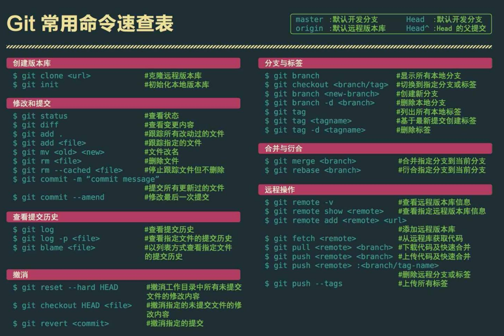

# Git：基础操作

## 导读

> 记录一下最基本常用的命令。

- Git常用命令速查表



- git常用命令

```shell
# 初始化本地git环境
git init

# 克隆一份代码到本地仓库
git clone XXX

# 把远程库的代码更新到工作台
git pull

# 强制把远程库的代码跟新到当前分支上面
git pull --rebase origin master

# 把远程库的代码更新到本地库
git fetch

# 把本地的修改加到stage中
git add .

# 把stage中的修改提交到本地库
git commit -m 'comments here'

# 把本地库的修改提交到远程库中
git push

# 查看远程分支/全部分支
git branch -r/-a

# 切换到某个分支
git checkout master/branch

# 新建test分支
git checkout -b test

# 删除test分支
git checkout -d test

# 假设当前在test分支上面，把master分支上的修改同步到test分支上
git merge master

# 调用merge工具
git merge tool

# 把未完成的修改缓存到栈容器中
git stash

# 查看所有的缓存
git stash list

# 恢复本地分支到缓存状态
git stash pop

# 查看某个文件的每一行的修改记录（）谁在什么时候修改的）
git blame someFile

# 查看当前分支有哪些修改
git status

# 查看当前分支上面的日志信息
git log

# 查看当前没有add的内容
git diff

# 查看已经add但是没有commit的内容
git diff --cache

# 上面两个内容的合并
git diff HEAD

# 撤销本地修改
git reset --hard HEAD

# 查看git config的HOME路径
echo $HOME

# 配置git config的HOME路径
export $HOME=/c/gitconfig
```

- 团队协作git操作流程

```shell
# 克隆代码库
git clone XXX

# 新建分支
git checkout -b test

# 完成修改
modify some files

# 把修改加入stage中
git add .
# 切换到master分支
git commit -m ''

review代码

# 切换到master分支
git checkout master

# 更新代码
git pull

# 切换到test分支
git checkout test

# 把master分支的代码merge到test分支
git meger master

# 把test分支的代码push到远程库
git push origin 分支名
```
